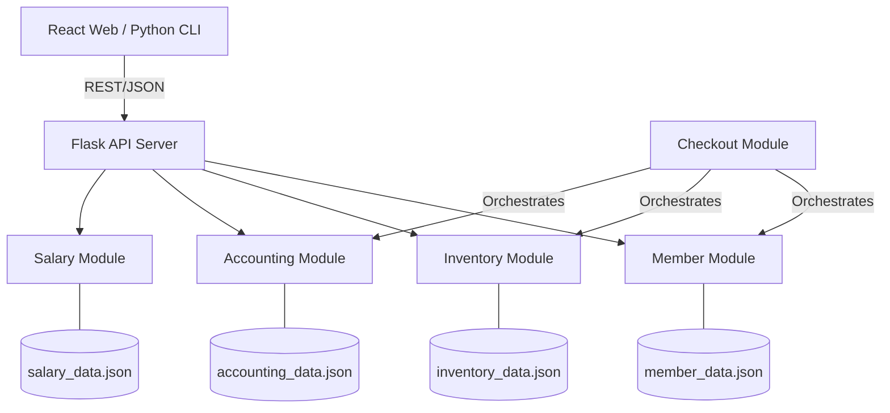

# Software Design Description (SDD)
## Smart Store Integration Platform

**Document Information**
| Item | Details |
| :--- | :--- |
| **Project** | Smart Store Integration Platform (SSIP) |
| **Version** | 1.0 |
| **Status** | Final Design |
| **Language** | English |

---

## 1. Introduction

### 1.1 Purpose
This SDD describes the system architecture, data design, and component-level details of the Smart Store Integration Platform. it provides a technical roadmap for developers to implement the business logic defined in the SRS.

### 1.2 System Scope
The SSIP is a modular retail management system. It aims to synchronize front-end retail activities (checkout, membership) with back-end administrative tasks (inventory, accounting, payroll).

---

## 2. System Architecture

### 2.1 Architectural Overview
The system follows a **Modular Client-Server Architecture**:
*   **Frontend**: A React/Vite web interface for modern UI and a Python CLI for administrative speed.
*   **API Layer**: Flask RESTful API handling HTTP requests and routing them to logic modules.
*   **Business Logic**: Decoupled Python modules (`member_system`, `inventory_system`, etc.).
*   **Data Tier**: Persistent JSON files ensuring lightweight and readable data storage.

### 2.2 Component Diagram


---

## 3. Design Considerations

### 3.1 Design Goals
*   **Modularity**: Each system (Inventory, Member, etc.) must function independently but provide APIs for integration.
*   **Persistence**: Data must be written to disk immediately after state changes to prevent loss.
*   **Scalability**: The system should allow adding new modules (e.g., Marketing, AI Analytics) without refactoring the core.

### 3.2 Constraints
*   **Single-Threaded JSON Access**: Since JSON files are used, the system must handle file I/O carefully to prevent race conditions during concurrent writes.
*   **No SQL Dependency**: Design must rely on native Python data structures (Dicts/Lists) serialized to JSON.

---

## 4. Data Design

### 4.1 Data Description (JSON Schemas)

#### Member Schema (`member_data.json`)
```json
{
  "id": "String",
  "name": "String",
  "email": "String",
  "password": "String (Plaintext)",
  "total_spending": "Float",
  "level": "Enum (bronze, silver, gold, vip)"
}
```

#### Inventory Schema (`inventory_data.json`)
```json
{
  "id": "String",
  "name": "String",
  "price": "Float",
  "stock": "Integer",
  "category": "String"
}
```

#### Accounting Ledger (`accounting_data.json`)
```json
{
  "total_balance": "Float",
  "transactions": [
    {
      "transaction_id": "String",
      "type": "revenue/expense",
      "amount": "Float",
      "items": "Array (Optional)"
    }
  ]
}
```

---

## 5. Module Design

### 5.1 Member System
*   **Logic**: Calculates discounts based on `level`.
*   **Method `update_spending(amount)`**: Increases spending and automatically promotes level (e.g., > 10,000 becomes Gold).

### 5.2 Inventory System
*   **Logic**: Manages SKU availability.
*   **Method `reduce_stock(item_id, qty)`**: Checks availability first; if true, subtracts from `stock` and saves to JSON.

### 5.3 Accounting System
*   **Logic**: Acts as the "Global Ledger".
*   **Method `record_expense(amount, desc)`**: Used by the Salary system to log personnel costs.
*   **Method `add_transaction(record)`**: Used by Checkout to log detailed customer receipts.

### 5.4 Salary System
*   **Logic**: Computes `Base + Bonus - Deductions`.
*   **Method `pay_worker(id)`**: Calls Accounting API to deduct funds and resets worker's `hours_worked`.

### 5.5 Checkout Engine (The Controller)
*   **Logic**: The high-level orchestrator.
*   **Process**:
    1.  Validate items and stock.
    2.  Identify member and apply tier-discount.
    3.  Execute "Commit Transaction" (Atomic update across Member, Inventory, and Accounting files).

---

## 6. Interface Design

### 6.1 External Interfaces
*   **Web Dashboard**: Developed in React 18, using Vite for fast builds. Displays real-time charts of store balance and inventory status.
*   **CLI Management**: menu-driven Python scripts for low-latency administrative tasks.

### 6.2 Internal Interfaces (REST API)
| Endpoint | Method | Purpose |
| :--- | :--- | :--- |
| `/api/members` | GET/POST | Fetch/Create members |
| `/api/inventory/<id>` | PUT | Update stock or price |
| `/api/accounting/balance`| GET | Real-time financial health check |
| `/api/salary/pay` | POST | Execute payroll and log as expense |

---

## 7. Security Design
*   **RBAC**: Owners can see `accounting_data.json`, whereas Workers can only access `inventory_data.json` and `checkout`.
*   **Input Validation**: Strict type checking (e.g., price must be positive Float) before JSON serialization.

